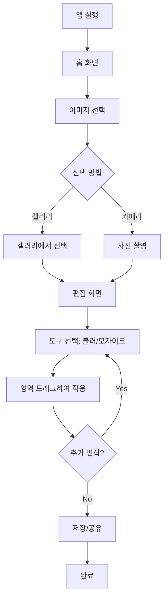

# Cover - Product Requirements Document (PRD)

## 1. Executive Summary

**Product Name**: Cover
**Version**: 1.0
**Date**: 2025-11-22
**Status**: Initial Planning

### Vision
Cover는 누구나 쉽게 사진 속 민감한 정보를 보호할 수 있는 멀티플랫폼 이미지 편집 애플리케이션입니다. 직관적인 인터페이스로 블러 및 모자이크 처리를 제공하여 개인정보 보호를 간편하게 만듭니다.

### Product Goals
- 모든 사용자가 3번의 탭 이내로 이미지 블러/모자이크 처리 완료
- 웹, iOS, Android 플랫폼 동시 지원
- 빠르고 직관적인 사용자 경험 제공

---

## 2. Target Audience

### Primary Users
- **일반 소비자** (18-45세)
  - SNS에 사진 업로드 전 개인정보 보호가 필요한 사용자
  - 차량 번호판, 얼굴, 주소 등을 가려야 하는 사용자

- **직장인 & 프리랜서**
  - 문서, 계약서, 영수증 등에서 민감 정보를 가려야 하는 사용자
  - 스크린샷 공유 시 개인정보 보호가 필요한 사용자

### Secondary Users
- 부동산 중개인, 중고거래 판매자
- 콘텐츠 크리에이터, 블로거

---

## 3. Platform & Technology Stack

### Platforms
- **iOS**: iOS 13.0+
- **Android**: Android 6.0+ (API Level 23+)

### Recommended Technology Stack
- **Framework**: Flutter 3.x
  - 단일 코드베이스로 모든 플랫폼 지원
  - 우수한 성능과 네이티브 수준의 UI/UX
  - 이미지 처리에 최적화된 라이브러리 생태계

- **Image Processing**:
  - `image` package (Dart): Basic decoding/encoding and pixel manipulation.
  - `custom_painter`: For real-time preview performance.

- **Storage**:
  - Local: `path_provider` (File storage).

---

## 4. Core Features

### 4.1 MVP Features

#### F1: Image Import
**Priority**: P0 (Must Have)

- **Description**: 사용자가 이미지를 앱으로 가져오기
- **Acceptance Criteria**:
  - [ ] 갤러리/사진첩에서 이미지 선택
  - [ ] 카메라로 직접 촬영
  - [ ] 최대 이미지 크기: 20MB
  - [ ] 지원 포맷: JPG, PNG, HEIC, WebP

#### F2: Blur Tool (블러 처리)
**Priority**: P0 (Must Have)

- **Description**: 선택한 영역에 블러 효과 적용
- **Acceptance Criteria**:
  - [ ] 손가락/마우스로 블러 영역 드래그
  - [ ] 블러 강도 조절 (3단계: 약함, 보통, 강함)
  - [ ] 브러시 크기 조절 (Small, Medium, Large)
  - [ ] 실시간 미리보기
  - [ ] Undo/Redo 기능 (최대 10단계)
  - [ ] 블러 영역 지우개 기능

**Technical Notes**:
- Use `CustomPainter` for real-time preview.
- Apply Gaussian Blur using the `image` package in an isolate.

#### F3: Mosaic Tool (모자이크 처리)
**Priority**: P0 (Must Have)

- **Description**: 선택한 영역에 모자이크 효과 적용
- **Acceptance Criteria**:
  - [ ] 손가락/마우스로 모자이크 영역 드래그
  - [ ] 픽셀 크기 조절 (3단계)
  - [ ] 브러시 크기 조절
  - [ ] 실시간 미리보기
  - [ ] Undo/Redo 기능
  - [ ] 모자이크 영역 지우개 기능

#### F4: Export & Save
**Priority**: P0 (Must Have)

- **Description**: 편집된 이미지 저장 및 공유
- **Acceptance Criteria**:
  - [ ] 원본 해상도 유지하여 저장
  - [ ] 갤러리/사진첩에 저장
  - [ ] 공유 기능 (SNS, 메신저 등)
  - [ ] 파일명 자동 생성 (Cover_YYYYMMDD_HHMMSS)

#### F5: Basic UI/UX
**Priority**: P0 (Must Have)

- **Description**: 직관적이고 사용하기 쉬운 인터페이스
- **Acceptance Criteria**:
  - [ ] 도구 선택 하단 바
  - [ ] 설정 조절 슬라이더
  - [ ] 미니멀한 디자인
  - [ ] 다크모드 지원

---

## 5. User Flow

### Primary User Flow: 이미지 블러 처리



---

## 6. Technical Requirements

### 6.1 Performance Requirements

- **이미지 처리 속도**
  - 블러/모자이크 적용: < 100ms (실시간 느낌)
  - 최종 저장: < 3초 (10MB 이미지 기준)

- **앱 크기**
  - iOS: < 30MB
  - Android: < 25MB

- **메모리 사용**
  - 최대 메모리: 200MB
  - 백그라운드 메모리: < 50MB

### 6.2 Security & Privacy

- **데이터 보호**
  - 모든 이미지 처리는 로컬 디바이스에서 수행
  - 서버 업로드 없음
  - 처리된 이미지는 사용자 디바이스에만 저장

- **권한 요청**
  - 카메라 (촬영 시)
  - 사진 라이브러리 (읽기/쓰기)

---

## 7. Design System

### 7.1 Color System

#### Brand Colors
```css
/* Primary - Trust & Professionalism */
--primary-500: #2196F3;  /* Main Brand Color */

/* Neutral Colors */
--bg-primary: #FFFFFF;
--bg-secondary: #F5F7FA;
--text-primary: #1A1A1A;
--text-secondary: #6B7280;

/* Dark Mode */
--dark-bg-primary: #0F0F0F;
--dark-bg-secondary: #1A1A1A;
--dark-text-primary: #FFFFFF;
```

### 7.2 Typography

- **iOS**: SF Pro Display, SF Pro Text
- **Android**: Roboto

### 7.3 Spacing (8px base)
```css
--space-2: 8px;
--space-4: 16px;
--space-6: 24px;
--space-8: 32px;
```

---

## 8. Screen Layouts

### Home Screen
```
┌─────────────────────────────────────┐
│  Cover                              │
│                                     │
│         [App Logo]                  │
│                                     │
│    "개인정보를 안전하게"              │
│                                     │
│  ┌─────────────────────────────┐   │
│  │  📷  카메라                  │   │
│  └─────────────────────────────┘   │
│                                     │
│  ┌─────────────────────────────┐   │
│  │  🖼️  갤러리                  │   │
│  └─────────────────────────────┘   │
│                                     │
└─────────────────────────────────────┘
```

### Editor Screen
```
┌─────────────────────────────────────┐
│ [<]                  [Undo] [Redo]  │
├─────────────────────────────────────┤
│                                     │
│         [Image Canvas]              │
│                                     │
├─────────────────────────────────────┤
│ [Blur] [Mosaic] [Eraser]           │
├─────────────────────────────────────┤
│ Size: ○────●────○                   │
│ Intensity: ○────●────○              │
├─────────────────────────────────────┤
│              [Save]                 │
└─────────────────────────────────────┘
```

---

## 9. Development Roadmap

### Phase 1: MVP (4-6 weeks)
**Goal**: 핵심 기능 출시

**Week 1-2: Foundation**
- Flutter 프로젝트 셋업
- 기본 UI 구현 (홈, 에디터 화면)
- 이미지 import 구현

**Week 3-4: Core Features**
- 블러 알고리즘 구현
- 모자이크 알고리즘 구현
- 지우개 기능 구현
- Undo/Redo 시스템

**Week 5-6: Polish & Launch**
- 저장/공유 기능
- 다크모드
- 테스팅 및 버그 수정
- 앱스토어 제출

---

## 10. Success Criteria

### Launch Success (3 months post-launch)
- [ ] 10,000+ 다운로드
- [ ] 4.0+ 평점
- [ ] < 0.5% 크래시율

---

**Document Version**: 2.0 (Simplified)
**Last Updated**: 2025-12-16
