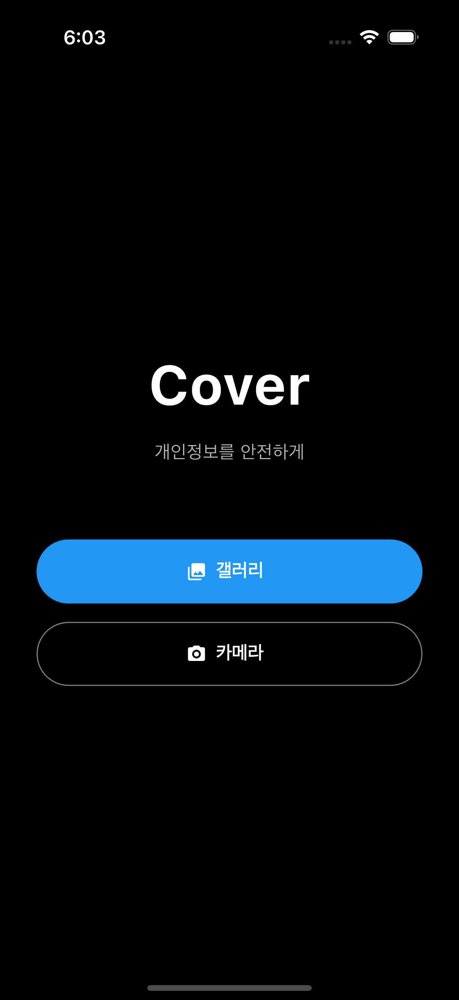
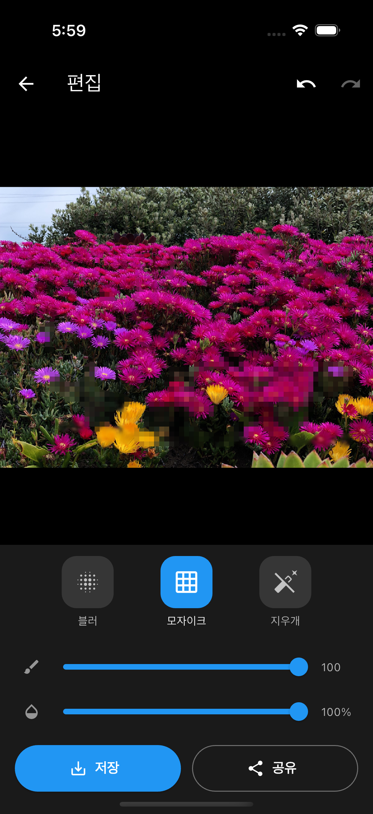

# Cover

개인정보를 안전하게 보호하는 이미지 편집 앱

<p align="center">
  
  
</p>

## 소개

Cover는 사진 속 민감한 정보를 쉽고 빠르게 블러/모자이크 처리할 수 있는 크로스플랫폼 앱입니다. 직관적인 인터페이스로 3번의 탭 이내에 개인정보를 보호할 수 있습니다.

## 기능

### 이미지 가져오기
- 갤러리에서 이미지 선택
- 카메라로 직접 촬영

### 편집 도구
| 도구 | 설명 |
|------|------|
| 블러 | 가우시안 블러 효과 적용 |
| 모자이크 | 픽셀화 효과 적용 |
| 지우개 | 편집 영역 원본 복원 |

### 조절 옵션
- 브러시 크기: 20~100px
- 효과 강도: 10~100%
- Undo/Redo: 최대 10단계

### 내보내기
- 갤러리에 저장
- SNS/메신저 공유

## 기술 스택

- **Framework**: Flutter
- **Language**: Dart
- **Image Processing**: `image` package
- **Platform**: iOS, Android

## 설치 및 실행

### 요구사항
- Flutter 3.x
- Dart 3.9.2+
- iOS 13.0+ / Android 6.0+

### 실행 방법

```bash
# 의존성 설치
flutter pub get

# 앱 실행
flutter run
```

### 빌드

```bash
# iOS
flutter build ios

# Android
flutter build apk
```

## 프로젝트 구조

```
lib/
└── main.dart       # 앱 전체 코드 (단일 파일)
    ├── HomeScreen      # 홈 화면 (갤러리/카메라 선택)
    ├── EditorScreen    # 편집 화면
    ├── _processImage   # 이미지 처리 (Isolate)
    └── ImageCanvasPainter  # 캔버스 렌더링
```

## 라이선스

MIT License
